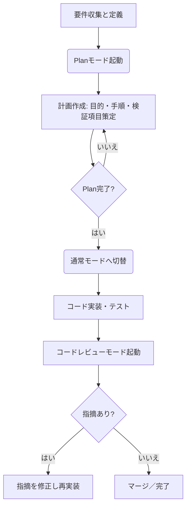

# エグゼクティブサマリー

Codexの**プランモード**は、要件整理や方針決定に重点を置き、コード実装前に計画を明確化する機能です。公式には「コンテキストを集め、曖昧な点を質問して強固なプランを構築する」ことが推奨されており【26†L604-L606】、小規模タスクでも目的・手順・検証項目を先に固定することで設計と実装の分離を実現します【19†L160-L166】【9†L104-L109】。一方、**コードレビューモード**は、実装済みのコード差分を読み込み、コードの正確性やセキュリティなどに焦点を当てて優先度付きの指摘を行う機能です。`/review`コマンドを用いて差分を選択するとワーキングツリーを変更せずにレビュープリセットが起動し、行動可能な指摘を返します【24†L670-L679】【12†L80-L89】。本報告では、両モードに適したスキルセット（優先度付き）や思考法、チェックリスト、ワークフローを整理し、比較表やテンプレート、学習リソースを示します。不明な点は明示し、公式ドキュメントや信頼できる技術ブログを優先的に引用しました。

---

## プランモード (Plan Mode)

【28†embed_image】Codex CLIでは`/plan`または`Shift+Tab`でPlanモードに切り替えられる（図は選択UI例）。Planモードは「要件を整理し方針を提案する」役割を担い、必要があれば詳細な計画を作成します【9†L104-L109】【19†L160-L166】。特に複数ファイルや複雑な仕様変更では、計画段階で**目的・範囲・手順・検証基準**を明確化することで、実装段階の迷走やリワークを防止します。Codex公式ベストプラクティスでも「Planモードでコンテキストを集め、強固なプランを構築すること」が推奨されています【26†L604-L606】。

- **必要技術スキル（優先度順）**:
  1. **要件分析・タスク分解能力**：機能の目的や仕様を正しく理解し、作業項目を分解できること。【9†L104-L109】  
  2. **設計/ドキュメント作成力**：非機能要件や検証方法を含む計画を明確に記述し、共有できること。【19†L160-L166】【20†L279-L287】  
  3. **テスト・検証知識**：計画段階でテスト項目や自動化手順を見越し、完了条件を定義できること。【20†L279-L287】  
  4. **コミュニケーション力**：曖昧な要求を言語化してCodexに伝え、必要な質問を引き出す能力。【19†L160-L166】  
  5. **バージョン管理操作**：`git stash`やブランチを使って計画作業と実装作業を分離する知識【19†L248-L256】。  

- **思考法／メタ認知**:
  - **上流志向**：開発着手前に「何をやるか」「やらないか」を決め、実装フェーズで要件が変わらないよう制御する【19†L160-L166】。  
  - **リスク先行**：設計段階で失敗パターンや依存関係を洗い出し、Planに組み込む（例：ロールバック手順やエラーハンドリングの明示）【20†L279-L287】。  
  - **工程分離**：Plan→実装を「1レーン」で行い、途中で不明点が出れば必ずPlanに戻って解決する姿勢【19†L160-L166】【20†L277-L285】。  
  - **簡潔維持**：Planが冗長化しないようテンプレートに沿って作成し、Plan完了後すぐに実装に移る【19†L248-L256】【20†L270-L278】。  

- **代表的ツール／ワークフロー**:
  1. **Planモード切替**：`codex --enable collaboration_modes`で有効化し、`/plan`（またはShift+Tab）でPlanモードに移行【19†L208-L216】。`/status`で現在モードを確認可能。  
  2. **計画プロンプト**：作業目的や範囲を要約したプロンプトを入力し、Codexに計画（マークダウン等）を生成させる。必要なら質問を受け付ける。  
  3. **テンプレート活用**：Planテンプレート（例：**目的 / 変更点 / 影響範囲 / 検証方法**）に沿ってPlan内容を整理する【20†L281-L287】【19†L248-L256】。  
  4. **Planの確認**：Codexが生成したPlanをレビューし、抜け・誤りがないか検証。必要なら修正指示を行う。  
  5. **実装への移行**：Planを完成させたら実装モード（通常モード）に戻し、Planの手順に従ってコードを実装する【19†L248-L256】【20†L271-L278】。  

- **行動例（チェックリスト形式）**:
  - [ ] **目的定義**：今回の変更・機能の狙い・価値を1行で明確化する【20†L281-L287】。  
  - [ ] **ゴールと非ゴール**：成功条件（完了定義）と除外項目を明示する（中～大規模時）【20†L281-L287】。  
  - [ ] **手順設計**：実装ステップをStep1..Nで箇条書きし、順序と担当を決める【20†L281-L287】。  
  - [ ] **影響範囲の特定**：変更対象のファイル・モジュール、依存関係を記載する【20†L263-L270】。  
  - [ ] **リスク/ロールバック**：潜在リスク・障害発生時の復旧手順を整理する（高リスク変更時）【20†L279-L287】。  
  - [ ] **検証項目**：実装後の確認方法（ユニットテスト／統合テスト・運用監視項目）を具体的に示す【20†L279-L287】。  
  - [ ] **Plan完了合意**：計画内容をチームと共有し、内容に問題なければCodexに実装モードへの切替を指示する。  

- **評価基準／成功の目安**:
  - Planで「Done条件（検証基準）が明確に書かれている」「必要な手順と資源が漏れなく計画されている」こと。  
  - Planが**冗長になりすぎていない**こと（目安：短期修正は簡潔に、中大規模はテンプレ追加項目を使用）。  
  - 実装段階でPlanに沿った成果物が得られ、要件の変更なく完了できること（Planモードの目的達成）【19†L160-L166】。  

- **リスクと落とし穴**:
  - Planが「ただ長いメモ」になり、かえってプロセス遅延につながるリスク【19†L248-L256】【20†L341-L349】。テンプレA/B/Cに沿って上限文字数・項目数を守る必要がある。  
  - Planモードは**プロンプト制御上の制約**であるため、実際にはコード生成を完全にブロックしない（意図せずコードが生成されることがある）【20†L349-L358】。重要変更時は使い捨てブランチ等で安全を確保すること。  
  - 計画完了後に実装に移行し忘れると工数浪費につながる。Plan完了時に必ずモードを戻して実装フェーズへ移行する運用ルールを設ける【19†L248-L256】。  

## コードレビューモード (Code Review Mode)

Codexの**コードレビューモード**は、実装済みのコード差分に対する静的解析・レビューを支援する機能です。`/review`コマンドを用いると、現在のブランチやコミット、未コミット変更からレビュープリセットを選択でき、Codexが差分を読み込んで**優先度付きの実用的な指摘**を返します【24†L670-L679】【12†L80-L89】。このモードではCodex自身がワーキングツリーを変更せず、問題箇所や改善案に関するコメントを出力するため、コミット前やPR前の品質保証に有効です。

- **必要技術スキル（優先度順）**:
  1. **コード読解力**：プログラミング言語やフレームワークに精通し、差分コードの意図を把握できること。  
  2. **バグ/脆弱性知識**：典型的なバグパターンやセキュリティ脆弱性（SQLインジェクション、認可欠如等）を認識できること【14†L161-L170】。  
  3. **最適化・パフォーマンス知識**：計算量やメモリ効率などパフォーマンス面の問題を見抜けること。  
  4. **コーディング規約・ベストプラクティス**：自プロジェクトや業界標準のコーディングスタイル、設計原則を理解していること。  
  5. **レビュー経験・批判的思考**：客観的にコードを評価し、明確で建設的なコメントができること。  

- **思考法／メタ認知**:
  - **問題発見者の視点**：コードを機能横断的に眺めて不具合やリスクを探す意識（例：入力検証・エラーハンドリング不足はないか）。  
  - **網羅的レビュー**：実装意図からずれた箇所や漏れがないか、テストの有無も含めて確認する。  
  - **事実ベースのコメント**：指摘は「なぜバグか」「どう直すべきか」を事実に基づいて明確に説明し、非難的にならないトーンを保つ【14†L180-L189】。  
  - **優先順位付け**：致命的バグ、セキュリティ、次サイクルで直すもの、余裕があれば直すもの、など重要度を分けて報告する【14†L193-L202】。  

- **代表的ツール／ワークフロー**:
  1. **レビュープリセット選択**：CLIで`/review`と入力し、PRスタイル（ブランチ差分）、未コミット変更、コミット指定、カスタム指示から適切なプリセットを選ぶ【12†L80-L89】【24†L670-L679】。  
  2. **対象指定**：レビュー対象の範囲（ベースブランチやコミットSHA）を指定。Codexが差分を読み込む。  
  3. **レビュー実行**：Codexが差分を解析し、レポート（コメントリスト）を生成する。オリジナルとの差分に基づく指摘が行われる。  
  4. **指摘確認・修正**：Codexのコメントを確認し、必要な修正を実施。修正後は同じプリセットで再レビューしたり、別の視点（セキュリティ特化など）で再実行する。  

- **行動例（チェックリスト形式）**:
  - [ ] **プリセット選択**：開発段階に応じて、`Review against base branch`（PR作成前の差分）、`Review uncommitted changes`（コミット前）など最適なプリセットを選ぶ【12†L80-L89】。  
  - [ ] **差分準備**：`git add`やブランチ操作でレビューしたい変更を用意し、Codexにその差分を分析させる。  
  - [ ] **主な観点チェック**：出力に沿って**バグ**、**セキュリティリスク**、**パフォーマンス**、**可読性/命名**、**ベストプラクティス**など多角的に点検する（Codexに指示する場合は例のような重点箇所を指定すると効果的）【21†L128-L136】。  
  - [ ] **指摘の優先付け**：Codexの指摘には[P0～P3]の優先度が付与される【14†L193-L202】。まずP0/P1レベルの修正を優先し、残りは次回以降に回す。  
  - [ ] **明確な質問**：不明点や追加確認が必要な場合、コード中にコメントやTodoを残し、Codexに「確認事項」や「追加テスト」を指示してもらう。  
  - [ ] **ドキュメント参照**：プロジェクト固有のコーディング規約やセキュリティガイドラインがあれば、それらを提示してCodexに従わせる。例えば`/review`にドキュメントを参照させるとプロンプトに組み込まれる【14†L147-L154】。  
  - [ ] **レビュー後確認**：修正後に再度`git diff -w`で差分チェックし、Codexに更新を確認させる。すべて解消されていればマージ/コミットする。  

- **評価基準／成功の目安**:
  - 発見される指摘が**実用的で具体的**であること。例えば、問題の原因と修正方法が明確に説明されている【14†L180-L189】。  
  - 重大度に応じた優先度（P0,P1…）が適切に設定されており、チームで対応方針を共有できる【14†L193-L202】。  
  - 軽微なスタイル上の差異など、重要度の低い項目は必要以上に出さない**ノイズの少なさ**（Codexは無意味な指摘を避けるよう設計されている【14†L161-L170】）。  
  - レビュー実施により**バグや重大問題が事前検出**され、品質が向上していること。  

- **リスクと落とし穴**:
  - Codexの指摘を鵜呑みにせず、必ず人間が判断を行うこと（AIも誤りを起こしうるため）。特にテスト不足指摘の正当性などは確認が必要。  
  - レビュー範囲指定を誤ると重要な変更を見逃す恐れがある。選択ミスやステージング忘れがないよう注意。  
  - 大規模なコミットではCodexの解析トークン量が増えるため、必要に応じて細分化やカスタム指示を利用し、処理性能を管理する。  
  - 既存のツール（静的解析器、テスト実行）と役割を適切に分担し、Codexを唯一のレビュー手段としないこと。あくまで補助ツールとして使う。  

## モード比較表

| 属性／次元       | プランモード (Plan)                                                        | コードレビューモード (Review)                                                |
|----------------|------------------------------------------------------------------------|---------------------------------------------------------------------------|
| **目的**         | 要件・目的を明確化し、実装前に方針と検証方法を計画する【9†L104-L109】【19†L160-L166】     | コード差分を解析し、バグや改善点を発見して修正する【24†L670-L679】                      |
| **主な利用タイミング** | 新機能追加や仕様変更の開始段階など、要件が固まりつつある場面                               | 実装完了前（コミット前）やPR作成前、既存コードの修正後                                |
| **代表的アウトプット**| 計画書（マークダウン等）: 目的、変更点、手順、検証項目など                         | レビューレポート: 問題箇所の指摘リスト（優先度付き）、修正提案、テスト指示              |
| **必要スキル**     | 要件分析、設計文書作成、テスト計画、コミュニケーション（大局観）                       | コード読解、バグ発見、セキュリティ・パフォーマンス知識、批判的思考（詳細観）            |
| **思考アプローチ**  | 「何をやるか/やらないか」を先に固定し、手順や完了条件を設計。迷ったらPlanに戻る【19†L160-L166】 | 「どこが間違っているか」を網羅的にチェック。事実ベースで指摘し優先順位をつける【14†L161-L170】 |
| **ツール／コマンド**| `codex /plan`（またはShift+Tab）でPlanモードに切替、テンプレートに沿って計画作成            | `codex /review`でプリセット選択【12†L80-L89】、ベースブランチやコミットを指定          |
| **チェックリスト例** | 目的定義、ゴール/非ゴール設定、手順設計、影響範囲、検証項目、リスク/ロールバック設定【20†L279-L287】 | バグ・脆弱性・性能・可読性チェック、テスト有無、コーディング規約準拠度など            |
| **評価基準**      | 計画の網羅性と実効性（完了条件が具体的か）【20†L279-L287】、計画に沿って実装できること          | 指摘の妥当性と有用性（説明の明確さ・具体性）【14†L180-L189】、重大度の適切な振り分け【14†L193-L202】 |
| **時間配分・効率**  | 初期投資時間はかかるが、明確な計画で実装フェーズの手戻りを削減【19†L160-L166】              | レビューに割く時間は発生するが、事前検出で後工程の手戻り削減。Gitフローに組み込みやすい           |
| **リスク・留意点** | Planが長文化しすぎると逆効果【19†L248-L256】。モード変更忘れに注意。実装との切替ルール運用必須   | AIの指摘は必ず人間が確認。解析トークン制限や適切な範囲選択に留意。レビュープリセットの使い分け推奨  |

## 実践的テンプレート・ワークフロー

### プランモード用テンプレート例

1. **Planモード起動**：Codex CLIで`/plan`（Shift+Tab）を実行しPlanモードに切替。【26†L604-L606】  
2. **Goal/Non-goal**：作業の**目的**（What）と**除外事項**を明記する（テンプレB/C）。例: `Goal: ○○機能追加。Non-goal: 既存UIは変更しない`【20†L279-L287】。  
3. **手順作成**：実装ステップを番号付きリストで記述。例: `Step1: モジュールAを修正 / Step2: DBマイグレーションを実行`【20†L279-L287】。  
4. **互換性・ロールバック**：既存機能への影響と、失敗時の退避策を決める（テンプレB）。例: `互換性: バージョン1.5未満非対応, ロールバック: フラグで旧処理継続`【20†L279-L287】。  
5. **検証計画**：ユニットテスト・E2Eテストなど、結果確認方法を記載。例: `検証: ユニット(test_*.py)、E2E(正常系/異常系)`【20†L281-L287】。  
6. **レビュー合意**：Plan完成後、チームへ共有。承認を得たら`/execute`（通常モード）へ切替え、実装を指示【19†L248-L256】。  

### コードレビューモード用テンプレート例

1. **差分準備**：レビューする変更をコミットまたはステージしておく。例えば、`feature`ブランチを作成し変更をコミットしておく。  
2. **レビュープリセット実行**：`/review`を入力し、**PRスタイル**（baseブランチ比較）や**未コミットレビュー**など適切なプリセットを選択【12†L80-L89】。  
3. **指摘確認**：Codexが出力したコメントを1つずつ確認。説明が十分か、改善案は具体的かを確認し、コードの該当箇所に反映する。  
4. **優先対応**：`[P0]`や`[P1]`レベルの高優先指摘から修正する。例: 「Nullチェック漏れ」「SQLインジェクションの可能性」など重大な指摘は即修正【14†L193-L202】。  
5. **再レビュー**：修正後、再度`/review`（同じプリセットまたはカスタム指示）を実行し、問題が解消されたか検証する。  
6. **ドキュメント更新**：必要に応じて設計書やコメントも更新し、レビュー時の学びをコードベースに反映する。  

### ワークフロー図（Plan→実装→レビュー）  

## 学習リソース（主なソース）

- **公式ドキュメント**: OpenAI Codex CLI/アプリのドキュメント（Planモード活用法、コードレビュー機能）【26†L604-L606】【24†L670-L679】。  
- **技術ブログ・記事**: Codexプランモード導入ガイド【19†L160-L166】【9†L104-L109】（日本語）、Codex CLIのレビュー機能解説【12†L80-L89】【14†L161-L170】（日本語）。  
- **チュートリアル/動画**: OpenAI公式YouTube「How to use Codex!」（Planモードとレビューコマンドの解説）【6†L597-L600】。  
- **学術論文・レポート**: Codex活用事例【30†L205-L214】（英語reddit、計画とレビューの連携事例）*（参考のみ）*。  
- **コミュニティ**: QiitaやZennの関連解説記事（Codex CLI入門、/reviewコマンド活用法など）【12†L80-L89】【21†L116-L125】。  

**注記**: 上記は主要な参考情報であり、Planモードとレビューモードの実践には公式ガイドやチームの運用ルールを併用することが推奨されます。Ÿ各種文献を参照しながら、自分のプロジェクトに合わせた最適なワークフローを確立してください。  

**主要参照リンク**:

- Codex CLI Features（コードレビュー機能）【24†L670-L679】  
- Codex Best Practices（プランモード推奨）【26†L604-L606】【26†L711-L719】  
- Qiita記事「/reviewコマンドでコードレビュー効率化」【12†L80-L89】【14†L161-L170】  
- SmartScope「Planモード完全ガイド」【19†L160-L166】【19†L248-L256】  
- Codex CLI 設定・入門記事【9†L104-L109】【21†L116-L125】  

